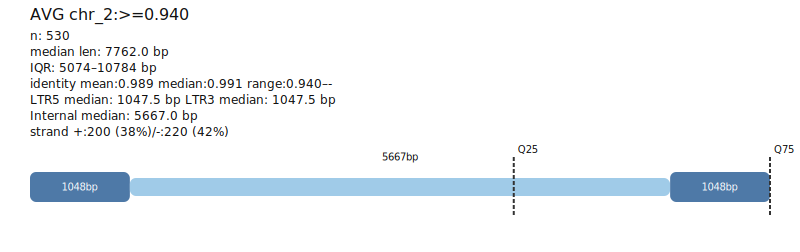

# Example Outputs

These captures come from a representative EDTA `intact` dataset and document a focused `chr_2` sweep.

## Reproducing this example
Set an environment variable (or substitute your own absolute path) pointing to the EDTA file:

```bash
export GFF3=/path/to/your/EDTA.intact.gff3
```

Then run:

```bash
python -m gff3_ltr_map.cli \
  "$GFF3" \
  --chrom chr_2 \
  --outdir runs/example_chr2 \
  --summary runs/example_chr2/summary.tsv \
  --visual postcard+quantiles \
  --out text+svg \
  --identity 'bins=0.90..0.94,>=0.94' \
  --top-k 5 \
  --min-n 25
```
Adjust `GFF3` or `--outdir` as needed for your workstation.

## Identity-bin table (CLI & TSV excerpt)
```
group	n	median_len	median_id	top_motifs	notes
chr_2:0.900-0.940	1	4424.0	0.931	TGCA (1, 100%)	LOW N (n=1)
chr_2:>=0.940	49	6134.0	0.979	TGCA (41, 84%), TGTA (3, 6%), TACA (2, 4%), TACT (1, 2%), TATA (1, 2%)	TSD consensus <40%
```

## ASCII postcards

### chr_2 ≥ 0.94 cohort
```
> AVG chr_2:>=0.940  range:0.940–-
  n: 49
  median len: 6134.0 bp
  IQR: 5120–10091 bp
  identity mean:0.977 median:0.979 range:0.940–-
  LTR5 median: 516.0 bp   LTR3 median: 510.0 bp
  Internal median: 5108.0 bp
  strand +:20 (41%)/-:18 (37%)

========-----------------------------------------------------------------------------------=========
LTR5:516 | INT:5624 | LTR3:6134
Q25:5120bp  Q75:10091bp
```

### chr_2 0.90–0.94 cohort
```
> AVG chr_2:0.900-0.940  range:0.900–0.940
  n: 1 (LOW N (n=1))
  median len: 4424.0 bp
  IQR: 4424–4424 bp
  identity mean:0.931 median:0.931 range:0.900–0.940
  LTR5 median: 492.0 bp   LTR3 median: 492.0 bp
  Internal median: 3440.0 bp
  strand +:1 (100%)

===========-----------------------------------------------------------------------------============
LTR5:492 | INT:3932 | LTR3:4424
Q25:4424bp  Q75:4424bp
```

## SVG postcard example



Shown above: `chr_2:>=0.940` postcard (`runs/example_chr2/identity_postcards/chr_2_0_940.svg`) highlighting the median-length bars, quartile ticks, cohort warnings, and motif/TSD leaders.
